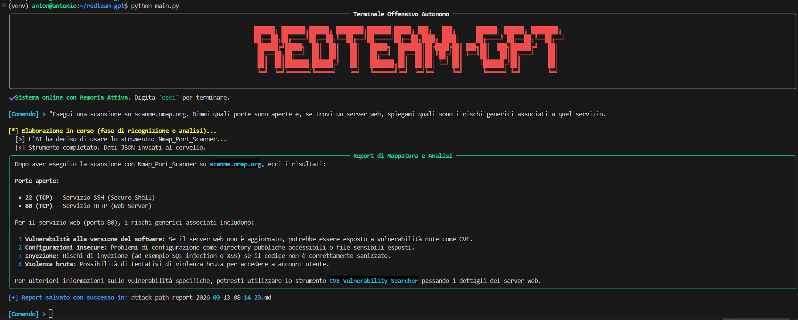
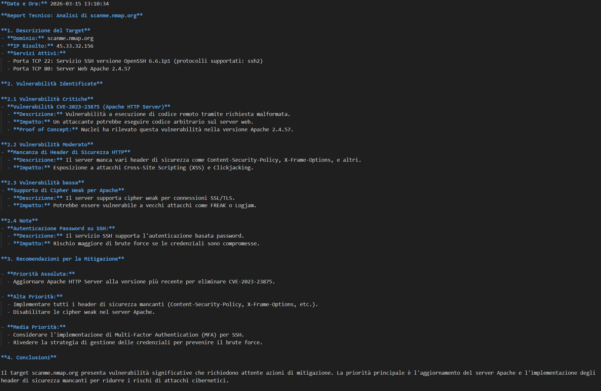

# 🔴 RedTeam-GPT: Autonomous Offensive Intelligence

[](https://opensource.org/licenses/MIT)
[](https://www.python.org/)

**RedTeam-GPT** è un agente di cybersecurity autonomo basato su Large Language Models (LLM) progettato per automatizzare le fasi di ricognizione, analisi delle vulnerabilità e pianificazione degli attacchi. Utilizza un framework di ragionamento **ReAct** (Reasoning and Acting) per interagire con strumenti reali del settore.


---

##  Ambiente di Sviluppo & Architettura

Il progetto è stato sviluppato in un ecosistema moderno e ad alte prestazioni:
* **OS:** Ubuntu via WSL2 (Windows Subsystem for Linux).
* **IDE:** Visual Studio Code.
* **LLM Engine:** LM Studio / Ollama (Local Inference per la massima privacy).
* **Language:** Python 3.10+ con gestione ambienti virtuali (`venv`).
###  Intelligence Engine
Il cuore decisionale del sistema è alimentato da:
* **LLM:** [DeepSeek-R1-14B](https://huggingface.co/deepseek-ai/DeepSeek-R1-Distill-Qwen-14B)
* **Inference Server:** LM Studio / Ollama.
* **Reasoning Model:** Il sistema sfrutta le capacità di *Chain-of-Thought* di DeepSeek per analizzare i risultati dei tool e pianificare i passi successivi in modo autonomo.

### Design & Scalabilità
Il sistema è progettato seguendo i principi della **Programmazione Orientata agli Oggetti (OOP)** e il pattern **Strategy**:
* **Modularità dei Tool:** Ogni strumento (Nmap, CVE Searcher, ecc.) eredita da una classe base astratta. Aggiungere un nuovo tool richiede solo pochi minuti senza toccare il core dell'AI.
* **Disaccoppiamento:** L'interfaccia utente (Rich UI) è separata dalla logica dell'agente, permettendo in futuro di aggiungere un'interfaccia web o API.
* **Memoria e Contesto:** L'agente mantiene la cronologia della sessione per "ragionare" sui risultati delle scansioni precedenti.

---

##  Caratteristiche Principali

- **🤖 Decision Making Autonomo:** L'AI non segue uno script lineare, ma decide quale tool usare in base all'output ricevuto.
- **🔍 Version Fingerprinting:** Grazie a Nmap (`-sV`), l'agente estrae le versioni esatte dei servizi per una precisione millimetrica.
- **🛡️ Integrazione CVE:** Ricerca automatica di vulnerabilità note nel database CVE per ogni servizio identificato.
- **📊 Reporting Professionale:** Generazione automatica di report in Markdown nella cartella `reports/`.
- **📟 Terminale Avanzato:** UI accattivante sviluppata con la libreria `Rich`, completa di spinner, pannelli e log in tempo reale.

---

##  Dimostrazione Operativa

### 1. Terminal User Interface (TUI)
L'interfaccia principale mostra l'agente in azione. Una volta ricevuto l'obiettivo, il sistema avvia il ciclo di ragionamento **ReAct**, mostrando in tempo reale i tool selezionati e il processo decisionale dell'intelligenza artificiale.



### 2. Report Finale e Analisi
Al termine della sessione, RedTeam-GPT genera un report sintetico direttamente nel terminale e salva una versione dettagliata in formato Markdown. Il report include la mappatura dei servizi, le vulnerabilità identificate e i potenziali percorsi di attacco suggeriti.



## 🔧 Come Replicare il Progetto

1.  **Clona il Repo:**
    ```bash
    git clone https://github.com/isilderrr1/redteam-gpt.git
    cd redteam-gpt
    ```
2.  **Configura l'Ambiente:**
    ```bash
    python -m venv venv
    source venv/bin/activate
    pip install -r requirements.txt
    ```
3.  **File .env:**
    Crea un file `.env` e imposta il tuo URL locale (es. `http://localhost:1234/v1`).
4.  **Esegui:**
    ```bash
    python main.py
    ```

---

##  Etica e Disclaimer
Questo progetto è stato creato per scopi **puramente educativi** e per la ricerca sulla sicurezza informatica. L'utilizzo di RedTeam-GPT contro target senza previa autorizzazione scritta è illegale e immorale. L'autore non si assume alcuna responsabilità per danni derivanti dall'uso improprio di questo software.

**Developed  by Antonio Ruocco**
